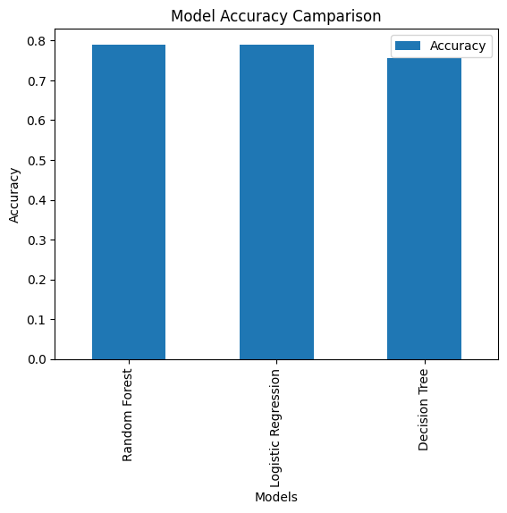

# Titanic_ML_Project

## Project Overview

This project uses Machine Learning techniques to predict whether a passenger survived the Titanic disaster. The dataset was preprocessed, analyzed, and multiple classification models were trained and compared.

## Dataset

* Source: Titanic Dataset (Kaggle)
* Target Variable: Survived
* Features Used:

  * Pclass
  * Sex
  * Age
  * Fare

## Data Preprocessing

* Handled missing values in the Age column.
* Converted categorical data (Sex) into numerical values.
* Selected important features for model training.

## Machine Learning Models

1. Random Forest Classifier
2. Logistic Regression
3. Decision Tree Classifier

## Model Performance

| Model               | Accuracy |
| ------------------- | -------- |
| Random Forest       | 79.02%   |
| Logistic Regression | 79.02%   |
| Decision Tree       | 75.52%   |

## Confusion Matrix

## Feature Importance

## Model Accuracy Comparison

## Results

* Random Forest and Logistic Regression achieved the highest accuracy (79.02%).
* Decision Tree showed lower performance (75.52%).
* Fare and Age were among the most influential features.
* The final model successfully predicted passenger survival with approximately 79% accuracy.

## Technologies Used

* Python
* Pandas
* NumPy
* Matplotlib
* Seaborn
* Scikit-learn

## Author

Humaira Siddique
