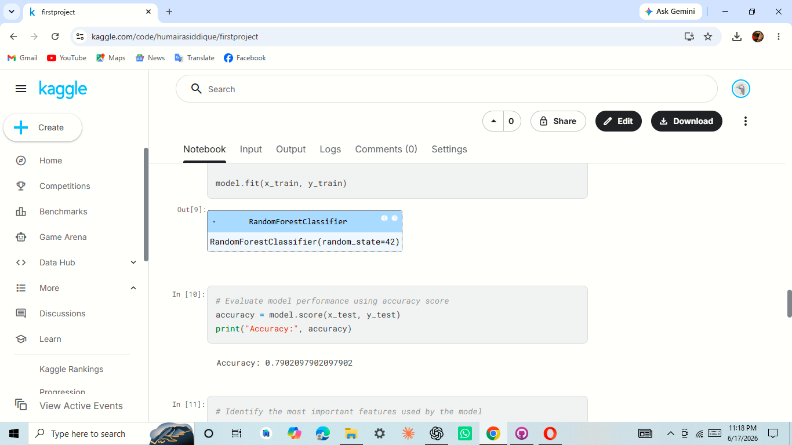
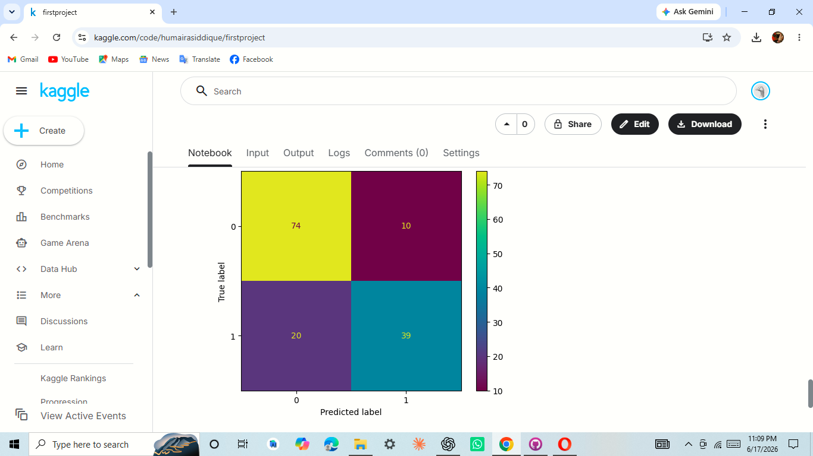
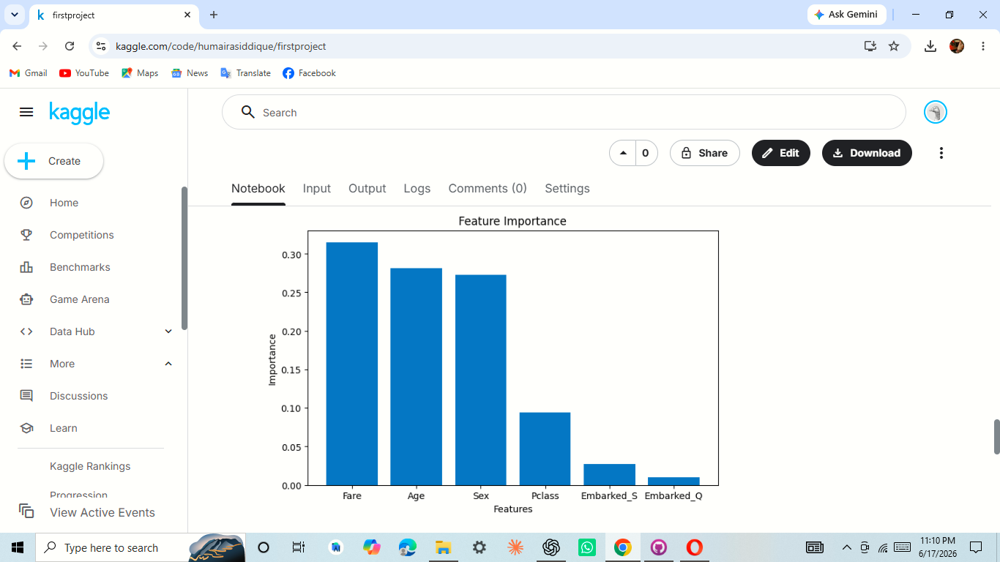

# Titanic_ML_Project 🚢

This project uses Machine Learning to predict whether a passenger survived the Titanic disaster based on passenger information such as age, gender, fare, and passenger class.

## Project Overview

The Titanic dataset is one of the most popular beginner Machine Learning datasets. In this project, data preprocessing, feature engineering, model training, and evaluation were performed to predict passenger survival.

## Technologies Used

- Python
- Pandas
- NumPy
- Matplotlib
- Scikit-learn

## Dataset

Dataset Source:
- Titanic Dataset from Kaggle

## Features Used

- Passenger Class (Pclass)
- Sex
- Age
- Fare

## Model Performance

- Accuracy: **79%**

## Feature Importance

The model identified the following features as the most influential:

1. Fare
2. Age
3. Sex
4. Pclass
## Accuracy



## Confusion Matrix



## Feature Importance Graph



## Project Structure

```text
Titanic_ML_Project/
│
├── Titanic_ML_Project.ipynb
├── README.md
└── images/
    ├── confusion_matrix.png
    └── feature importance.png
```

## Results

The model achieved approximately **79% accuracy** in predicting passenger survival, demonstrating the effectiveness of basic machine learning techniques on structured data.

## Author

Humaira Siddique
